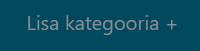
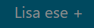
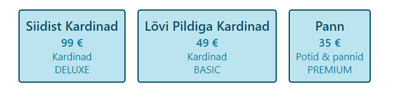

kui node_modules/ access error siis kustuta ja viska terminali:
docker-compose run --rm --no-deps backend-node install
docker-compose run --rm --no-deps frontend-react install

docker-compose down
docker-compose up

## FLOW

- Vajuta nupule "lisa kategooria", et tekitada uus kauba kategooria:

- Vajuta nupule "lisa ese", et lisada toode, juba eelnevalt salvestatud kategooria alla:

- Mõlemal juhul saad õnnestumise korral vastava teate:

- Avalehel on välja kuvatud gird view sisestatud esemetest:

